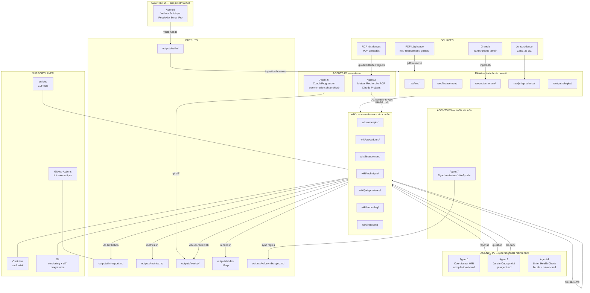

# ARCHITECTURE — copro-intel-angers

> Document de référence système. Dernière mise à jour : 2026-04-04.
> Ce fichier est le brief pour tout développeur IA qui reprend ce projet.

---

## 1. Vision

### Ce que c'est

`copro-intel-angers` est une **base de connaissance vivante en Markdown**, versionnée sous Git, construite par et pour Jean-Baptiste Lesaffre — en reconversion vers la gestion de copropriété (syndic), stagiaire chez Antoine Immobilier (Angers) à partir du 13 avril 2026.

Ce n'est pas un wiki statique. C'est un **système auto-améliorant** :
- Chaque document source ingéré enrichit le wiki.
- Chaque question posée à un agent, si filée back, enrichit le wiki.
- Chaque semaine de stage ajoute des cas réels documentés.
- Le LLM compile. JB steere. Le wiki compound.

### Pourquoi

1. **Mémoire externe persistante** : ne jamais réexpliquer un cas, une règle, un précédent.
2. **Différenciateur employabilité** : actif professionnel versionné et auditable — le diff Git prouve la progression.
3. **Support stage opérationnel** : Q&A juridique instantané, recherche dans les RCP, vérification délais légaux.
4. **Backend documentaire ValoSyndic** : `wiki/financement/` alimente les règles de calcul du simulateur propriétaire.

### Pour qui

- **JB d'abord** : outil quotidien de stage, terrain d'entraînement, préparation examens GPI Bloc 3.
- **Tout développeur IA qui reprend** : ce document est le brief complet. Lire aussi `AGENTS.md` et `README.md`.

### Principes fondateurs

> *"Tu n'écris jamais le wiki. Le LLM écrit. Tu steeres. Chaque réponse compound."*
> — Karpathy, 03/04/2026

> *"Le wiki n'encode pas que des faits. Il encode comment je pose les problèmes, quelles connexions je fais, ce que je juge worth pursuing. C'est du savoir tacite rendu machine-readable. C'est inimitable parce que l'editorial filter c'est moi."*
> — Inspiration Polanyi / Fletcher

**Contrainte absolue** : zéro infrastructure lourde. Pas de RAG vectoriel, pas de base de données. Markdown + Git + Claude Code + Claude API. Le LLM auto-maintient les index. Karpathy l'a prouvé à ~100 articles / ~400K mots sans RAG.

---

## 2. Architecture complète



### Boucle de capitalisation (core loop)

```
Question → Agent 2 (Juriste) → Réponse → file-back.md → WIKI enrichi → meilleure prochaine réponse
```

Règle d'or : **toute réponse produite par un agent doit être versée dans le wiki**. Si elle disparaît sans archivage, c'est de la connaissance perdue.

---

## 3. Agents — fiches détaillées

### Agent 1 — Compilateur Wiki

| Champ | Valeur |
|-------|--------|
| **Rôle** | Transformer les fichiers `raw/` en articles `wiki/` structurés |
| **Déclencheur** | Nouveau fichier dans `raw/` ou manuel |
| **Inputs** | Fichier `raw/*.md` (texte brut converti depuis PDF) |
| **Outputs** | Articles `wiki/` avec frontmatter YAML complet + backlinks `[[...]]` + mise à jour `wiki/index.md` |
| **Modèle** | `claude-sonnet-4-6` — volume élevé, coût maîtrisé |
| **Fréquence** | Quotidien — après chaque capture terrain |
| **Priorité** | **P0 — opérationnel** |
| **Fichier** | `prompts/compile-to-wiki.md` |
| **Script** | `scripts/ingest.sh <fichier>` génère le prompt à copier dans Claude Code |

Règle : incrémental. Ne recompiler que les articles affectés par le nouveau document. Citer la source `raw/` dans le frontmatter `source:` de chaque article créé.

---

### Agent 2 — Juriste Copropriété

| Champ | Valeur |
|-------|--------|
| **Rôle** | Q&A juridique de premier niveau — Loi 65-557, Décret 67-223, Convention IRSI |
| **Déclencheur** | Question terrain en langage naturel |
| **Inputs** | Question + contexte du cas + wiki complet (lu par le LLM) |
| **Outputs** | Réponse structurée : article cité + base légale exacte + formulation courrier si pertinent + file-back automatique |
| **Modèle** | `claude-opus-4-6` — précision juridique maximale |
| **Fréquence** | Ad hoc — plusieurs fois/jour en stage |
| **Priorité** | **P0 — opérationnel** |
| **Fichiers** | `prompts/qa-agent.md` (Q&A unifié) + `prompts/agents/juriste-copro.md` (rôle spécialisé) |
| **Script** | `scripts/search.sh "question"` génère le prompt de base |

Toujours terminer par `prompts/file-back.md` sur la réponse obtenue.

Agents spécialisés complémentaires (dans `prompts/agents/`) :
- `comptable-copro.md` — charges, budget, fonds travaux
- `redacteur-pv.md` — procès-verbaux AG
- `redacteur-mail.md` — courriers syndic
- `diagnostiqueur-technique.md` — pathologies bâtiment

---

### Agent 3 — Moteur Recherche RCP

| Champ | Valeur |
|-------|--------|
| **Rôle** | Recherche sémantique dans les Règlements de Copropriété par résidence |
| **Déclencheur** | Question sur une résidence spécifique |
| **Inputs** | Question + nom résidence (le RCP est uploadé dans le Projet Claude correspondant) |
| **Outputs** | Clause trouvée + numéro article RCP + recommandation de traitement (IRSI si sinistre, majorité si travaux) |
| **Modèle** | `claude-sonnet-4-6` avec Projects RAG (PDF uploadé nativement) |
| **Fréquence** | Ad hoc — qualification sinistres, préparation AG, litige |
| **Priorité** | **P1 — avril 2026** |
| **Fichiers** | `projects/juriste-copropriete/SYSTEM_PROMPT.md` + `projects/portefeuille-105-lots/SYSTEM_PROMPT.md` |

**Action requise** : uploader les RCP de chaque résidence dans le projet Claude `portefeuille-105-lots`. Un projet par résidence si volumes importants.

---

### Agent 4 — Linter / Health Check

| Champ | Valeur |
|-------|--------|
| **Rôle** | Audit hebdomadaire du wiki : structure, cohérence, lacunes, fraîcheur légale |
| **Déclencheur** | Vendredi (workflow hebdomadaire) ou push sur `main` (GitHub Actions) |
| **Inputs** | `wiki/` entier |
| **Outputs** | `outputs/lint-report-YYYY-MM-DD.md` : frontmatter manquant, liens cassés, articles orphelins, `[À VÉRIFIER]` non résolus, lacunes thématiques, backlog d'articles à créer |
| **Modèle** | `claude-sonnet-4-6` pour la phase LLM (Phase 2 : analyse sémantique) |
| **Fréquence** | Hebdomadaire + chaque push main |
| **Priorité** | **P0 — opérationnel** |
| **Fichiers** | `scripts/lint.sh` (checks automatiques) + `prompts/lint-wiki.md` (Phase 1 : structure, Phase 2 : Heal, Phase 3 : backlog) |
| **CI** | `.github/workflows/lint.yml` — lance lint + metrics + sources-catalog à chaque push main |

---

### Agent 5 — Veilleur Juridique

| Champ | Valeur |
|-------|--------|
| **Rôle** | Veille hebdomadaire : nouvelles décisions copropriété, modifications législatives, circulaires ANAH |
| **Déclencheur** | Dimanche soir — n8n cron |
| **Inputs** | Topics surveillés : `copropriété France`, `jurisprudence Cass 3e civ`, `ANAH MPRc`, `CEE copropriété`, `Loi 65-557 modification` |
| **Outputs** | `outputs/veille/veille-YYYY-MM-DD.md` — sources candidates + résumé + recommandation d'ingestion (oui/non/à vérifier) |
| **Modèle** | Perplexity Sonar Pro (web search) → `claude-sonnet-4-6` (synthèse et qualification) |
| **Fréquence** | Hebdomadaire |
| **Priorité** | **P2 — juin 2026** |
| **Stack** | n8n workflow : cron → Perplexity API → Claude API → commit `outputs/veille/` |

La **décision d'ingestion reste humaine** : le Veilleur propose, JB valide avant `ingest.sh`.

---

### Agent 6 — Coach Progression

| Champ | Valeur |
|-------|--------|
| **Rôle** | Analyser l'évolution du raisonnement sur les cas documentés, générer des questions d'entretien personnalisées |
| **Déclencheur** | Fin de semaine (vendredi) ou à la demande (pré-entretien, bilan de stage) |
| **Inputs** | `git diff` sur `raw/notes-terrain/` sur période choisie + `wiki/` entier |
| **Outputs** | Rapport : évolution des patterns de raisonnement + questions d'entretien dérivées des **cas réels documentés** (pas de questions génériques) + bilan de compétences prouvées par les cas |
| **Modèle** | `claude-opus-4-6` — analyse nuancée, pas de surface |
| **Fréquence** | Hebdomadaire + à la demande |
| **Priorité** | **P1 — amélioration mai 2026** |
| **Fichiers** | `scripts/weekly-review.sh` (base existante) + `prompts/weekly-review.md` (flashback + synthèse) |

**Amélioration P1** : enrichir `weekly-review.sh` pour extraire le diff thématique `raw/notes-terrain/` et l'injecter dans le prompt Coach.

---

### Agent 7 — Synchronisateur ValoSyndic

| Champ | Valeur |
|-------|--------|
| **Rôle** | Détecter les divergences entre les règles documentées dans `wiki/financement/` et les règles implémentées dans ValoSyndic |
| **Déclencheur** | Modification significative de `wiki/financement/` ou demande manuelle |
| **Inputs** | Contenu `wiki/financement/` + code source des règles de calcul ValoSyndic (Next.js/TypeScript) |
| **Outputs** | `outputs/valosyndic-sync-YYYY-MM-DD.md` — divergences : règle wiki non implémentée \| règle implémentée non documentée |
| **Modèle** | `claude-sonnet-4-6` |
| **Fréquence** | À chaque mise à jour `wiki/financement/` significative |
| **Priorité** | **P3 — août 2026** |
| **Prérequis** | Accès repo ValoSyndic dans le même contexte Claude Code |

---

## 4. Roadmap

### Phase 1 — Fondations (avril-mai 2026)

**Objectif** : système opérationnel dès J+1 du stage (13 avril)

| Tâche | Priorité | Agent |
|-------|----------|-------|
| Compiler `raw/lois/loi-n-65-557...md` → wiki/concepts/ (~15 articles attendus) | P0 | A1 |
| Compiler `raw/lois/decret-n-67-223...md` → wiki/procedures/ | P0 | A1 |
| Compiler `raw/lois/convention-irsi.md` → wiki/concepts/ + wiki/procedures/ | P0 | A1 |
| Compiler `raw/financement/anah-202509...md` → wiki/financement/ (premier article) | P0 | A1 |
| Uploader RCPs du portefeuille dans Claude Projects `portefeuille-105-lots` | P1 | A3 |
| Mettre en place workflow quotidien : Granola → `raw/notes-terrain/` → compile → file-back → commit | P0 | A1+A2 |
| Enrichir `scripts/weekly-review.sh` : extraction diff thématique `notes-terrain/` | P1 | A6 |
| Compiler `raw/financement/` complet (8 fichiers) → `wiki/financement/` | P1 | A1 |

**Résultat attendu** : wiki à ~30 articles / ~50K mots. Workflow quotidien rodé.

---

### Phase 1.5 — Google Drive + Allégement repo (mai 2026)

**Objectif** : repo < 100 MB, gros fichiers sur Drive

| Tâche | Priorité | Agent |
|-------|----------|-------|
| Déplacer `Ressources/` (122 MB de PDFs) vers Google Drive | P1 | — |
| Créer `scripts/drive-link.sh` : référencement Drive dans frontmatter `source_drive:` | P1 | — |
| Mettre à jour les `source:` des articles existants avec liens Drive | P1 | A1 |
| Ajouter `Ressources/` au `.gitignore` après migration | P1 | — |

**Résultat attendu** : repo < 100 MB. PDFs accessibles via liens Drive dans le frontmatter.

---

### Phase 2 — Agents automatisés (juin-juillet 2026)

**Objectif** : réduire la charge manuelle, activer la veille passive

| Tâche | Priorité | Agent |
|-------|----------|-------|
| Construire n8n workflow Veilleur Juridique (Perplexity Sonar Pro → outputs/veille/) | P2 | A5 |
| Ingestion jurisprudence Cour de cassation 3e civ. → `raw/jurisprudence/` | P2 | A1 |
| Compiler `raw/notes-terrain/` accumulées → patterns de cas dans wiki/ | P1 | A1+A6 |
| Enrichir Coach Progression : questions d'entretien depuis cas réels (pas génériques) | P1 | A6 |
| Enrichir Linter : détection articles non mis à jour > 60 jours + alerte fraîcheur légale | P2 | A4 |
| Compiler `raw/stock/` pertinent (guides pratiques, pathologies) → wiki/technique/ | P2 | A1 |

**Résultat attendu** : wiki à ~60 articles / ~150K mots. Veille passive opérationnelle.

---

### Phase 3 — Automation complète + ValoSyndic (août+)

**Objectif** : système auto-améliorant, backend ValoSyndic actif

| Tâche | Priorité | Agent |
|-------|----------|-------|
| Construire Agent 7 (Synchronisateur ValoSyndic) | P3 | A7 |
| n8n : automatiser pipeline complet ingestion (Granola webhook → raw/ → compile → commit) | P3 | A1 |
| Générer export portfolio : PDF "compétences prouvées par cas documentés" | P3 | A6 |
| Évaluer fine-tuning LLM si volume atteint ~400K mots | P3 | — |

**Résultat attendu** : wiki à ~100 articles / ~400K mots. ValoSyndic aligné en continu.

---

### Phase 4 — AI Chief of Staff + Dashboard (post-stage, vision)

**Objectif** : Le Présent v2 — copilote syndic complet avec interface web

| Tâche | Priorité | Agent |
|-------|----------|-------|
| MCP Server Gmail : lecture mails entrants + brouillons automatiques | P4 | A8 (nouveau) |
| MCP Server Calendar : préparation réunions + rappels | P4 | A8 |
| Dashboard web Nothing-inspired (Next.js + shadcn/ui + Tailwind) | P4 | — |
| `scripts/productivity-report.sh` : tracking CA et productivité | P4 | A6 |
| Couche d'abstraction LLM (`config/llm-provider.json`) pour portabilité | P4 | — |
| Notifications push lundi matin (veille + agenda semaine) | P4 | A5+A8 |
| Orchestrateur multi-agents avec routing intelligent (style Pal) | P4 | — |

**Résultat attendu** : système autonome, dashboard temps réel, mails en brouillon auto, veille push. Voir `wiki/outils/productivity-assistant-design.md` et `wiki/outils/design-system-dashboard.md` pour la vision complète.

---

## 5. Règles d'or

### Ce qu'on fait toujours

- **Toute affirmation juridique** cite l'article exact (Loi 65-557 art. X, Décret 67-223 art. Y) ou porte `[À VÉRIFIER]`.
- **Toute réponse agent** est filée back dans le wiki via `prompts/file-back.md`. Pas de connaissance éphémère.
- **Chaque capture terrain Granola** → `raw/notes-terrain/` dans les 24h.
- **Git commit quotidien minimum** — le diff Git EST le journal de progression, pas un log de code.
- **Nouveau fichier `raw/`** → `compile-to-wiki` avant la fin de la semaine.
- **Sources primaires d'abord** : Légifrance consolidé > guide pratique > résumé.

### Ce qu'on ne fait jamais

- Modifier directement un article `wiki/` sans passer par le pipeline `raw/ → compile`. Sauf correction factuelle urgente documentée.
- Utiliser de la RAG vectorielle ou une base de données externe. Le LLM lit le markdown directement — c'est le principe.
- Publier ou partager `wiki/meta/` (`sensitivity: internal` — culture cabinet, interlocuteurs, prestataires).
- Accepter une réponse agent sur un point juridique sans vérifier la citation sur Légifrance.
- Créer de la redondance : si une information existe dans le wiki, on enrichit, on ne duplique pas.
- Résumer un document source pour `raw/` — texte intégral ou rien (`status: raw`).

---

## 6. KPIs de succès

| KPI | Signal "ça marche" | Comment mesurer |
|-----|--------------------|-----------------|
| **Mémoire externalisée** | "Je n'ai plus à réexpliquer le contexte à Pierre-Henri" | Nb articles wiki cités dans des échanges réels avec le superviseur |
| **Précision juridique** | Zéro erreur de citation en AG ou dans un courrier | Nb `[À VÉRIFIER]` → 0 sur articles `status: validated` |
| **Progression documentée** | Le wiki de semaine 8 répond mieux que ma mémoire de semaine 1 | `git log --since="8 weeks ago" --oneline -- wiki/` |
| **Couverture sources** | 79 PDFs tous compilés en articles | `./scripts/sources-catalog.sh` : 100% ingérés + 100% compilés |
| **Volume wiki** | Cap Karpathy atteint | `./scripts/metrics.sh` : ≥ 100 articles, ≥ 400K mots |
| **Vélocité terrain** | Délai Granola → wiki article < 24h | Timestamp `notes-terrain/` vs `updated:` dans le frontmatter |
| **ValoSyndic aligné** | 0 divergence règle/documentation | `outputs/valosyndic-sync.md` : liste vide |

---

## 7. Référence rapide — fichiers critiques

| Fichier | Rôle |
|---------|------|
| `AGENTS.md` | Conventions système, frontmatter obligatoire, types d'articles, ton |
| `README.md` | Workflows quotidien/hebdo/mensuel, démarrage rapide |
| `INDEX.md` | Inventaire opérationnel, statuts |
| `prompts/compile-to-wiki.md` | Agent 1 — compilation raw → wiki |
| `prompts/qa-agent.md` | Agent 2 — Q&A unifié avec file-back |
| `prompts/file-back.md` | Boucle de capitalisation — **utiliser après CHAQUE session agent** |
| `prompts/lint-wiki.md` | Agent 4 — audit 3 phases (structure, heal, backlog) |
| `prompts/weekly-review.md` | Agent 6 — synthèse hebdo + flashback (répétition espacée) |
| `scripts/ingest.sh` | Classify raw file → génère prompt compile |
| `scripts/pdf-to-raw.sh` | Conversion PDF/TXT → markdown brut |
| `scripts/lint.sh` | Checks automatiques frontmatter/liens |
| `scripts/metrics.sh` | Dashboard progression (articles, mots, couverture) |
| `scripts/weekly-review.sh` | Génère revue hebdo + liste fichiers modifiés |
| `scripts/render.sh` | Génère prompt Marp slides depuis article wiki |
| `scripts/sources-catalog.sh` | Tracking ingestion 79 PDFs → raw/ → wiki/ |
| `.github/workflows/lint.yml` | CI : lint + metrics + sources-catalog sur push main |
